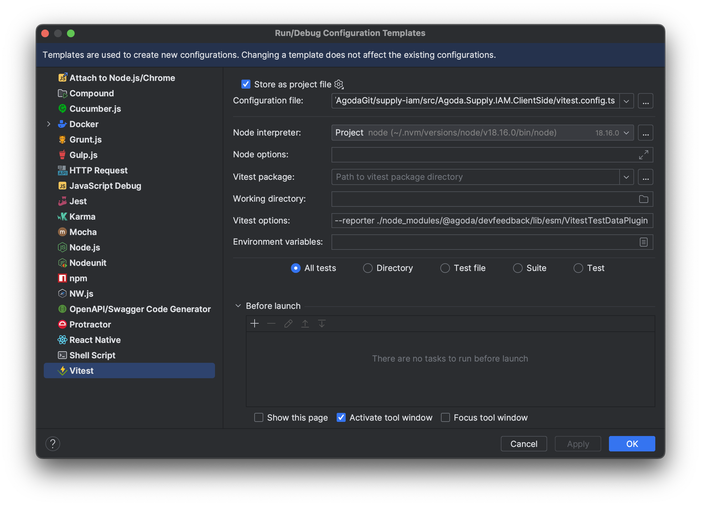

# Test Data

Requires `@agoda-com/devfeedback` version 1.1.1 or later.

## Usage

### Basic usage

#### Vitest

If you use **Vitest**, you can add the following to your `vitest.config.js` file:

```javascript
import { VitestTestDataPlugin } from '@agoda-com/devfeedback'

export default defineConfig({
  ...,
  test: {
    ...,
    reporters: ['default', new VitestTestDataPlugin()],
  },
})
```

Don't forget to keep `'default'` reporter in the list, otherwise you won't be able to see your test result in the console.

or if you are running tests using command line, you might need to add `--reporter` flag to your command like:

```bash
yarn vitest --reporter ./node_modules/@agoda-com/devfeedback/lib/esm/VitestTestDataPlugin run
```

##### IntelliJ IDE (WebStorm)

To support IntelliJ IDE such as WebStorm that some of your developers might be using, you'll need to add test configuration template to your project.

1. Go to `Run` -> `Edit Configurations...`
2. Click `Edit configuration templates...`
3. Click `Vitest`



- Tick `Store as project file`
- Fill `Configuration file` with your `vitest.config.js` file
- Add `--reporter ./node_modules/@agoda-com/devfeedback/lib/esm/VitestTestDataPlugin` to `Vitest options`
- Make sure it applies on `All tests`
- Click `OK` and this will create a new file in `.run` folder in your project directory

_Please note that the Vitest template will apply only to new Vitest run configurations, you might need to delete the old ones to run tests with the new template._

### Advanced usage

As same as build time, test data collection also sends the command that you used to run the build like `yarn test` to be the custom identifier which should work in most cases in order to help you distinguish between different test configurations.

However, if you would like to define your own identifier, you can do so by passing it as a parameter to the plugin.

```javascript
VitestTestDataPlugin(testOnlyPartA ? 'test-only-part-a' : 'test-everything');
```
